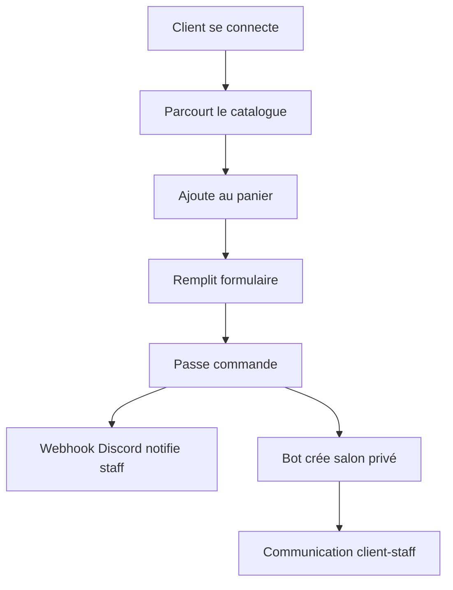

# 🏢 Dynasty 8 - Agence Immobilière FiveM

Site web ultra moderne pour l'agence immobilière Dynasty 8 sur le serveur NewWave.


## 🌟 Fonctionnalités

### Pour les visiteurs
- 🏠 **Catalogue interactif** avec filtres avancés (prix, catégorie, type)
- 🔍 **Recherche** de propriétés
- 🛒 **Panier** pour sélectionner plusieurs propriétés
- 👤 **Connexion Discord OAuth** sécurisée
- 📱 **Design responsive** optimisé mobile et desktop

### Pour les Admins (Role ID: 1459196167991595008)
- ➕ **Ajouter des propriétés** avec formulaire dynamique
- 🏷️ **Créer des catégories** personnalisées
- 📊 **Panel admin** pour gérer propriétés et commandes
- 🗑️ **Supprimer** des propriétés
- ✅ **Gérer les statuts** des commandes

### Système de commande automatique
- 🎫 **Création automatique de salons Discord** pour chaque commande
- 📢 **Notifications webhook** pour le staff
- 👥 **Permissions automatiques** (client + staff avec role ID: 1459196844432294066)
- 💬 **Communication directe** client-vendeur via Discord

## 🎨 Design

- **Style** : Moderne et professionnel avec thème sombre
- **Couleurs** : Gradient amber/orange sur fond slate
- **Animations** : Transitions fluides et effets hover
- **UX** : Navigation intuitive et cards interactives

## 🛠️ Technologies

- **Frontend** : React + TypeScript
- **Styling** : Tailwind CSS v4
- **Backend** : Supabase Edge Functions (Deno + Hono)
- **Base de données** : Supabase KV Store
- **Auth** : Discord OAuth 2.0
- **Notifications** : Discord Webhooks + Bot API
- **UI Components** : shadcn/ui
- **Toast** : Sonner

## 📦 Structure du projet

```
dynasty8/
├── components/
│   ├── Navbar.tsx              # Navigation avec auth
│   ├── Hero.tsx                # Section hero page d'accueil
│   ├── Catalog.tsx             # Catalogue avec filtres
│   ├── PropertyCard.tsx        # Card de propriété
│   ├── PropertyDetails.tsx     # Modal détails
│   ├── AddPropertyForm.tsx     # Formulaire ajout (admin)
│   ├── Cart.tsx                # Panier et checkout
│   └── AdminPanel.tsx          # Panel administration
├── supabase/
│   └── functions/
│       └── server/
│           └── index.tsx       # API backend
├── App.tsx                     # Component principal
└── GUIDE_INSTALLATION.md       # Guide complet

```

## 🚀 Déploiement sur Netlify

### Méthode 1 : Via GitHub (Recommandé)

1. Push le code sur GitHub
2. Connectez votre repo sur Netlify
3. Netlify détectera automatiquement la configuration

### Méthode 2 : Drag & Drop

1. Allez sur https://app.netlify.com/drop
2. Glissez-déposez le dossier du projet
3. Votre site est en ligne !

### Configuration post-déploiement

⚠️ **Important** : Après le déploiement, ajoutez l'URL Netlify dans :
1. Discord Developer Portal → OAuth2 → Redirects
2. Format : `https://VOTRE-SITE.netlify.app`

## 🔧 Configuration requise

### Discord Developer Portal

1. **Application OAuth** : `1459197358347911262`
2. **Bot** : Invité avec permissions Admin
3. **Webhook** : Configuré pour les notifications

### Secrets Supabase (déjà configurés)

- ✅ `SUPABASE_URL`
- ✅ `SUPABASE_ANON_KEY`
- ✅ `SUPABASE_SERVICE_ROLE_KEY`
- ✅ `DISCORD_CLIENT_SECRET` (à configurer)
- ✅ `DISCORD_BOT_TOKEN` (à configurer)

### IDs Discord

- **Guild ID** : `1459195760150319290`
- **Role Admin** : `1459196167991595008`
- **Role Ticket Staff** : `1459196844432294066`

## 📚 Documentation

Consultez le fichier **GUIDE_INSTALLATION.md** pour :
- Configuration complète Discord
- Configuration des secrets
- Instructions de déploiement
- Troubleshooting
- Explication du système de tickets

## 🎯 Catégories de propriétés

Par défaut :
- Appartements
- Appartements luxueux
- Maisons modernes
- Bureaux
- Entrepôts
- Club de biker
- Garages

Les admins peuvent ajouter des catégories personnalisées !

## 🔐 Système d'authentification

1. **Connexion** via Discord OAuth 2.0
2. **Vérification** de l'appartenance au serveur
3. **Détection automatique** des permissions admin
4. **Session** stockée en local et backend

## 🎫 Flux de commande



## 🌐 Compatibilité

- ✅ Chrome, Firefox, Safari, Edge
- ✅ Desktop et Mobile
- ✅ Tablettes

## 📱 Responsive Design

- **Mobile** : Navigation optimisée, grids adaptatives
- **Tablet** : Layout 2 colonnes
- **Desktop** : Layout 3 colonnes, hover effects

## ⚡ Performance

- **Images** : Lazy loading automatique
- **Code** : React optimisé
- **API** : Cache et optimisations Supabase

## 🤝 Support

Pour toute question, consultez :
1. Le fichier GUIDE_INSTALLATION.md
2. Les logs Supabase
3. La console Discord Developer

## 📄 Licence

Projet créé pour le serveur FiveM NewWave - Dynasty 8

---

**Créé avec ❤️ pour Dynasty 8 - NewWave Server**
